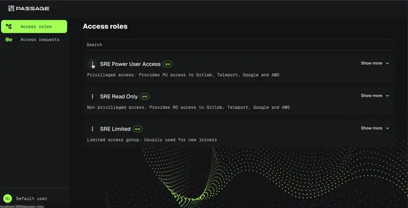

# Overview

## What is Passage?
Passage Server is a powerful, open-source access control management solution built in Go. It provides a centralized portal for managing and automating role-based access across multiple platforms and cloud services. Designed with flexibility and scalability in mind.



Head to [Passage documentation](https://cto2bpublic.github.io/passage/) to know more.


## Available Scripts

- `yarn start` - Start the development server
- `yarn build` - Build the project for production
- `yarn preview` - Preview the production build
- `yarn lint` - Run ESLint to check for code issues

## Deployment

To deploy the project, first build it and then serve the `build` folder:

```sh 
  yarn build
```

## License

This project is licensed under the GNU General Public License v3.0. See the [LICENSE](LICENSE) file for details.

